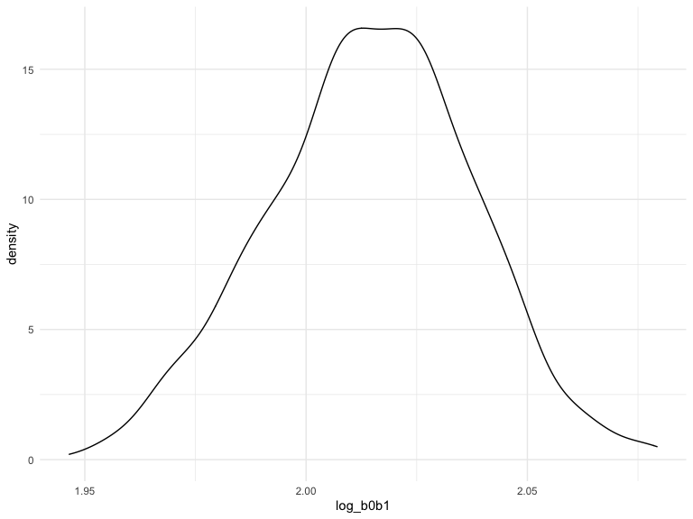

p8105_hw6_fm2751
================
Fengyi Ma

## Problem 0

### Load libraries

``` r
library(tidyverse)
library(modelr)
library(mgcv)
```

## Problem 1

To obtain a distribution for $\hat{r}^2$, we’ll follow basically the
same procedure we used for regression coefficients: draw bootstrap
samples; the a model to each; extract the value I’m concerned with; and
summarize. Here, we’ll use `modelr::bootstrap` to draw the samples and
`broom::glance` to produce `r.squared` values.

``` r
weather_df = 
  rnoaa::meteo_pull_monitors(
    c("USW00094728"),
    var = c("PRCP", "TMIN", "TMAX"), 
    date_min = "2017-01-01",
    date_max = "2017-12-31") %>%
  mutate(
    name = recode(id, USW00094728 = "CentralPark_NY"),
    tmin = tmin / 10,
    tmax = tmax / 10) %>%
  select(name, id, everything())
```

    ## Registered S3 method overwritten by 'hoardr':
    ##   method           from
    ##   print.cache_info httr

    ## using cached file: ~/Library/Caches/R/noaa_ghcnd/USW00094728.dly

    ## date created (size, mb): 2022-09-29 10:32:48 (8.401)

    ## file min/max dates: 1869-01-01 / 2022-09-30

``` r
weather_df %>% 
  modelr::bootstrap(n = 1000) %>% 
  mutate(
    models = map(strap, ~lm(tmax ~ tmin, data = .x) ),
    results = map(models, broom::glance)) %>% 
  select(-strap, -models) %>% 
  unnest(results) %>% 
  ggplot(aes(x = r.squared)) + geom_density()
```


In this example, the $\hat{r}^2$ value is high, and the upper bound at 1
may be a cause for the generally skewed shape of the distribution. If we
wanted to construct a confidence interval for $R^2$, we could take the
2.5% and 97.5% quantiles of the estimates across bootstrap samples.
However, because the shape isn’t symmetric, using the mean +/- 1.96
times the standard error probably wouldn’t work well.

We can produce a distribution for $\log(\beta_0 * \beta1)$ using a
similar approach, with a bit more wrangling before we make our plot.

``` r
weather_df %>% 
  modelr::bootstrap(n = 1000) %>% 
  mutate(
    models = map(strap, ~lm(tmax ~ tmin, data = .x) ),
    results = map(models, broom::tidy)) %>% 
  select(-strap, -models) %>% 
  unnest(results) %>% 
  select(id = `.id`, term, estimate) %>% 
  pivot_wider(
    names_from = term, 
    values_from = estimate) %>% 
  rename(beta0 = `(Intercept)`, beta1 = tmin) %>% 
  mutate(log_b0b1 = log(beta0 * beta1)) %>% 
  ggplot(aes(x = log_b0b1)) + geom_density()
```



As with $r^2$, this distribution is somewhat skewed and has some
outliers.

The point of this is not to say you should always use the bootstrap –
it’s possible to establish “large sample” distributions for strange
parameters / values / summaries in a lot of cases, and those are great
to have. But it is helpful to know that there’s a way to do inference
even in tough cases.

## Problem 2

### Import and clean the dataset, create new variables

``` r
homicide_data = read.csv("./data/homicide-data.csv") %>% janitor::clean_names() 

homicide = homicide_data %>% 
  mutate(
    city_state = str_c(city,",",state),
    solution_status = ifelse(disposition == "Closed by arrest","unsolved","solved")) %>% 
   mutate(
      victim_sex = fct_relevel(victim_sex, "Female"),
      victim_race = fct_relevel(victim_race, "White"),
         ) %>% 
  filter(!city_state %in% c("Dallas, TX", "Phoenix, AZ", "Kansas City, MO", "Tulsa,AL"),
         victim_race == "White" | victim_race == "Black") %>%
  mutate(victim_age = as.numeric(victim_age))

head(homicide)
```

    ##          uid reported_date  victim_last victim_first victim_race victim_age
    ## 1 Alb-000003      20100601  SATTERFIELD      VIVIANA       White         15
    ## 2 Alb-000005      20100102         MULA       VIVIAN       White         72
    ## 3 Alb-000006      20100126         BOOK    GERALDINE       White         91
    ## 4 Alb-000009      20100130 MARTIN-LEYVA      GUSTAVO       White         56
    ## 5 Alb-000012      20100218        LUJAN        KEVIN       White         NA
    ## 6 Alb-000016      20100308         GRAY     STEFANIA       White         43
    ##   victim_sex        city state      lat       lon           disposition
    ## 1     Female Albuquerque    NM 35.08609 -106.6956 Closed without arrest
    ## 2     Female Albuquerque    NM 35.13036 -106.5810 Closed without arrest
    ## 3     Female Albuquerque    NM 35.15111 -106.5378        Open/No arrest
    ## 4       Male Albuquerque    NM 35.07538 -106.5535        Open/No arrest
    ## 5       Male Albuquerque    NM 35.07701 -106.5649 Closed without arrest
    ## 6     Female Albuquerque    NM 35.07066 -106.6158      Closed by arrest
    ##       city_state solution_status
    ## 1 Albuquerque,NM          solved
    ## 2 Albuquerque,NM          solved
    ## 3 Albuquerque,NM          solved
    ## 4 Albuquerque,NM          solved
    ## 5 Albuquerque,NM          solved
    ## 6 Albuquerque,NM        unsolved

### logistic regression for Baltimore, estimate & 95CI

``` r
log_Baltimore = homicide %>% 
  filter(city == "Baltimore") %>% 
  mutate(solution_status = fct_relevel(solution_status,"solved")) %>% 
  glm(solution_status ~ victim_age + victim_sex + victim_race, data = ., family = binomial())

log_Baltimore %>% 
   broom::tidy() %>% 
  knitr::kable(digits = 3)
```

| term             | estimate | std.error | statistic | p.value |
|:-----------------|---------:|----------:|----------:|--------:|
| (Intercept)      |    1.152 |     0.237 |     4.865 |   0.000 |
| victim_age       |   -0.007 |     0.003 |    -2.024 |   0.043 |
| victim_sexMale   |   -0.854 |     0.138 |    -6.184 |   0.000 |
| victim_raceBlack |   -0.842 |     0.175 |    -4.818 |   0.000 |

``` r
save(log_Baltimore, file = "./result/log_Baltimore.RData")

male_vs_female =
log_Baltimore %>% 
  broom::tidy() %>% 
  mutate(
    OR = exp(estimate),
    CI_Lower = exp(estimate - 1.96*std.error),
    CI_Upper = exp(estimate + 1.96*std.error)) %>%
  select(term, estimate, OR, CI_Lower, CI_Upper) %>%
  filter(term == "victim_sexMale")

male_vs_female %>% 
  knitr::kable(digits = 3)
```

| term           | estimate |    OR | CI_Lower | CI_Upper |
|:---------------|---------:|------:|---------:|---------:|
| victim_sexMale |   -0.854 | 0.426 |    0.325 |    0.558 |

Now run glm for each of the cities in your dataset, and extract the
adjusted odds ratio (and CI) for solving homicides comparing male
victims to female victims. Do this within a “tidy” pipeline, making use
of purrr::map, list columns, and unnest as necessary to create a
dataframe with estimated ORs and CIs for each city.

### logistic regression for all cities

``` r
city_df = 
  homicide %>% 
  group_by(city_state) %>% 
  mutate(
    solution_status = ifelse(solution_status == "solved", 1, 0),
    victim_sex = fct_relevel(victim_sex, "Female"),
    victim_race = fct_relevel(victim_race, "White"),
  ) %>% 
  select(city_state, solution_status, victim_age, victim_sex, victim_race) %>% 
  drop_na()

log_city_df =
  city_df %>%
  nest(data = -city_state) %>% 
  mutate(
    glm_cities = map(.x = data, ~glm(solution_status ~ victim_age + victim_sex + victim_race, data = .x, family = binomial())),
 tidy_output = map(.x = glm_cities, ~broom::tidy(.x))) %>% 
  select(city_state, tidy_output) %>% 
  unnest(tidy_output) %>% 
  mutate(
    OR = exp(estimate),
    CI_Lower = exp(estimate - 1.96*std.error),
    CI_Upper = exp(estimate + 1.96*std.error)) %>%
  filter(term == "victim_sexMale") %>% 
  select(city_state, OR, CI_Lower, CI_Upper)

log_city_df %>% 
  knitr::kable()
```

| city_state        |        OR |  CI_Lower | CI_Upper |
|:------------------|----------:|----------:|---------:|
| Albuquerque,NM    | 0.5657710 | 0.2658911 | 1.203865 |
| Atlanta,GA        | 0.9999229 | 0.6834958 | 1.462841 |
| Baltimore,MD      | 2.3501115 | 1.7925469 | 3.081104 |
| Baton Rouge,LA    | 2.6216492 | 1.4382067 | 4.778899 |
| Birmingham,AL     | 1.1494051 | 0.7587197 | 1.741265 |
| Boston,MA         | 1.4836988 | 0.7836854 | 2.808987 |
| Buffalo,NY        | 1.9209697 | 1.0692890 | 3.451007 |
| Charlotte,NC      | 1.1313528 | 0.7129281 | 1.795355 |
| Chicago,IL        | 2.4384403 | 1.9977915 | 2.976282 |
| Cincinnati,OH     | 2.5010774 | 1.4768017 | 4.235767 |
| Columbus,OH       | 1.8779889 | 1.3340567 | 2.643698 |
| Denver,CO         | 2.0874123 | 1.0301914 | 4.229593 |
| Detroit,MI        | 1.7171886 | 1.3629112 | 2.163558 |
| Durham,NC         | 1.2309943 | 0.5940727 | 2.550777 |
| Fort Worth,TX     | 1.4948122 | 0.8869460 | 2.519278 |
| Fresno,CA         | 0.7489713 | 0.3256358 | 1.722654 |
| Houston,TX        | 1.4064176 | 1.1030800 | 1.793171 |
| Indianapolis,IN   | 1.0884610 | 0.8049581 | 1.471812 |
| Jacksonville,FL   | 1.3892471 | 1.0355165 | 1.863811 |
| Las Vegas,NV      | 1.1943039 | 0.8667649 | 1.645616 |
| Long Beach,CA     | 2.4377380 | 0.9241570 | 6.430257 |
| Los Angeles,CA    | 1.5108443 | 1.0457505 | 2.182787 |
| Louisville,KY     | 2.0385092 | 1.2662734 | 3.281692 |
| Memphis,TN        | 1.3827062 | 1.0117132 | 1.889742 |
| Miami,FL          | 1.9408508 | 1.1469578 | 3.284255 |
| Milwaukee,wI      | 1.3752649 | 0.9432352 | 2.005177 |
| Minneapolis,MN    | 1.0560123 | 0.5333664 | 2.090799 |
| Nashville,TN      | 0.9668955 | 0.6401305 | 1.460463 |
| New Orleans,LA    | 1.7095849 | 1.2326837 | 2.370990 |
| New York,NY       | 3.8110074 | 2.0034962 | 7.249217 |
| Oakland,CA        | 1.7759407 | 1.1514889 | 2.739032 |
| Oklahoma City,OK  | 1.0266153 | 0.6577486 | 1.602343 |
| Omaha,NE          | 2.6144741 | 1.3873758 | 4.926909 |
| Philadelphia,PA   | 2.0150096 | 1.5332191 | 2.648195 |
| Pittsburgh,PA     | 2.3215173 | 1.4287320 | 3.772186 |
| Richmond,VA       | 0.9939844 | 0.4919778 | 2.008231 |
| San Antonio,TX    | 1.4192046 | 0.8009392 | 2.514725 |
| Sacramento,CA     | 1.4951219 | 0.7482156 | 2.987627 |
| Savannah,GA       | 1.1534268 | 0.5617806 | 2.368173 |
| San Bernardino,CA | 1.9986235 | 0.6838914 | 5.840833 |
| San Diego,CA      | 2.4211621 | 1.1696031 | 5.011979 |
| San Francisco,CA  | 1.6459924 | 0.8582768 | 3.156664 |
| St. Louis,MO      | 1.4221382 | 1.0726551 | 1.885487 |
| Stockton,CA       | 0.7397942 | 0.3399453 | 1.609951 |
| Tampa,FL          | 1.2380790 | 0.5330494 | 2.875605 |
| Tulsa,OK          | 1.0248323 | 0.6444402 | 1.629757 |
| Washington,DC     | 1.4489156 | 0.9833077 | 2.134995 |
