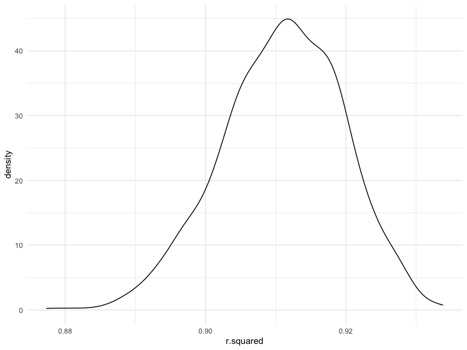

p8105_hw6_fm2751
================
Fengyi Ma

## Problem 0

### Load libraries

``` r
library(tidyverse)
library(modelr)
library(mgcv)
```

## Problem 1

To obtain a distribution for $\hat{r}^2$, we’ll follow basically the
same procedure we used for regression coefficients: draw bootstrap
samples; the a model to each; extract the value I’m concerned with; and
summarize. Here, we’ll use `modelr::bootstrap` to draw the samples and
`broom::glance` to produce `r.squared` values.

``` r
weather_df = 
  rnoaa::meteo_pull_monitors(
    c("USW00094728"),
    var = c("PRCP", "TMIN", "TMAX"), 
    date_min = "2017-01-01",
    date_max = "2017-12-31") %>%
  mutate(
    name = recode(id, USW00094728 = "CentralPark_NY"),
    tmin = tmin / 10,
    tmax = tmax / 10) %>%
  select(name, id, everything())
```

    ## Registered S3 method overwritten by 'hoardr':
    ##   method           from
    ##   print.cache_info httr

    ## using cached file: ~/Library/Caches/R/noaa_ghcnd/USW00094728.dly

    ## date created (size, mb): 2022-09-29 10:32:48 (8.401)

    ## file min/max dates: 1869-01-01 / 2022-09-30

``` r
weather_df %>% 
  modelr::bootstrap(n = 1000) %>% 
  mutate(
    models = map(strap, ~lm(tmax ~ tmin, data = .x) ),
    results = map(models, broom::glance)) %>% 
  select(-strap, -models) %>% 
  unnest(results) %>% 
  ggplot(aes(x = r.squared)) + geom_density()
```



In this example, the $\hat{r}^2$ value is high, and the upper bound at 1
may be a cause for the generally skewed shape of the distribution. If we
wanted to construct a confidence interval for $R^2$, we could take the
2.5% and 97.5% quantiles of the estimates across bootstrap samples.
However, because the shape isn’t symmetric, using the mean +/- 1.96
times the standard error probably wouldn’t work well.

We can produce a distribution for $\log(\beta_0 * \beta1)$ using a
similar approach, with a bit more wrangling before we make our plot.

``` r
weather_df %>% 
  modelr::bootstrap(n = 1000) %>% 
  mutate(
    models = map(strap, ~lm(tmax ~ tmin, data = .x) ),
    results = map(models, broom::tidy)) %>% 
  select(-strap, -models) %>% 
  unnest(results) %>% 
  select(id = `.id`, term, estimate) %>% 
  pivot_wider(
    names_from = term, 
    values_from = estimate) %>% 
  rename(beta0 = `(Intercept)`, beta1 = tmin) %>% 
  mutate(log_b0b1 = log(beta0 * beta1)) %>% 
  ggplot(aes(x = log_b0b1)) + geom_density()
```


As with $r^2$, this distribution is somewhat skewed and has some
outliers.

The point of this is not to say you should always use the bootstrap –
it’s possible to establish “large sample” distributions for strange
parameters / values / summaries in a lot of cases, and those are great
to have. But it is helpful to know that there’s a way to do inference
even in tough cases.

## Problem 2

### Import and clean the dataset, create new variables

``` r
homicide_data = read.csv("./data/homicide-data.csv") %>% 
  janitor::clean_names() 

homicide = homicide_data %>% 
  mutate(
    city_state = str_c(city,",",state),
    solution_status = ifelse(disposition == "Closed by arrest","solved","unsolved")) %>% 
   mutate(
      victim_sex = fct_relevel(victim_sex, "Female"),
      victim_race = fct_relevel(victim_race, "White"),
         ) %>% 
  filter(!city_state %in% c("Dallas, TX", "Phoenix, AZ", "Kansas City, MO", "Tulsa,AL"),
         victim_race == "White" | victim_race == "Black") %>%
  mutate(victim_age = as.numeric(victim_age))

head(homicide)
```

    ##          uid reported_date  victim_last victim_first victim_race victim_age
    ## 1 Alb-000003      20100601  SATTERFIELD      VIVIANA       White         15
    ## 2 Alb-000005      20100102         MULA       VIVIAN       White         72
    ## 3 Alb-000006      20100126         BOOK    GERALDINE       White         91
    ## 4 Alb-000009      20100130 MARTIN-LEYVA      GUSTAVO       White         56
    ## 5 Alb-000012      20100218        LUJAN        KEVIN       White         NA
    ## 6 Alb-000016      20100308         GRAY     STEFANIA       White         43
    ##   victim_sex        city state      lat       lon           disposition
    ## 1     Female Albuquerque    NM 35.08609 -106.6956 Closed without arrest
    ## 2     Female Albuquerque    NM 35.13036 -106.5810 Closed without arrest
    ## 3     Female Albuquerque    NM 35.15111 -106.5378        Open/No arrest
    ## 4       Male Albuquerque    NM 35.07538 -106.5535        Open/No arrest
    ## 5       Male Albuquerque    NM 35.07701 -106.5649 Closed without arrest
    ## 6     Female Albuquerque    NM 35.07066 -106.6158      Closed by arrest
    ##       city_state solution_status
    ## 1 Albuquerque,NM        unsolved
    ## 2 Albuquerque,NM        unsolved
    ## 3 Albuquerque,NM        unsolved
    ## 4 Albuquerque,NM        unsolved
    ## 5 Albuquerque,NM        unsolved
    ## 6 Albuquerque,NM          solved

### logistic regression for Baltimore, estimate & 95CI

``` r
log_Baltimore = homicide %>% 
  filter(city == "Baltimore") %>% 
  mutate(solution_status = fct_relevel(solution_status,"solved")) %>% 
  glm(solution_status ~ victim_age + victim_sex + victim_race, data = ., family = binomial())

log_Baltimore %>% 
   broom::tidy() %>% 
  knitr::kable(digits = 3)
```

| term             | estimate | std.error | statistic | p.value |
|:-----------------|---------:|----------:|----------:|--------:|
| (Intercept)      |   -1.152 |     0.237 |    -4.865 |   0.000 |
| victim_age       |    0.007 |     0.003 |     2.024 |   0.043 |
| victim_sexMale   |    0.854 |     0.138 |     6.184 |   0.000 |
| victim_raceBlack |    0.842 |     0.175 |     4.818 |   0.000 |

``` r
save(log_Baltimore, file = "./result/log_Baltimore.RData")

male_vs_female =
log_Baltimore %>% 
  broom::tidy() %>% 
  mutate(
    OR = exp(estimate),
    CI_Lower = exp(estimate - 1.96*std.error),
    CI_Upper = exp(estimate + 1.96*std.error)) %>%
  select(term, estimate, OR, CI_Lower, CI_Upper) %>%
  filter(term == "victim_sexMale")

male_vs_female %>% 
  knitr::kable(digits = 3)
```

| term           | estimate |   OR | CI_Lower | CI_Upper |
|:---------------|---------:|-----:|---------:|---------:|
| victim_sexMale |    0.854 | 2.35 |    1.793 |    3.081 |

### logistic regression for all cities

``` r
city_df = 
  homicide %>% 
  group_by(city_state) %>% 
  mutate(
    solution_status = ifelse(solution_status == "solved", 1, 0),
    victim_sex = fct_relevel(victim_sex, "Female"),
    victim_race = fct_relevel(victim_race, "White"),
  ) %>% 
  select(city_state, solution_status, victim_age, victim_sex, victim_race) %>% 
  drop_na()

log_city_df =
  city_df %>%
  nest(data = -city_state) %>% 
  mutate(
    glm_cities = map(.x = data, ~glm(solution_status ~ victim_age + victim_sex + victim_race, data = .x, family = binomial())),
 tidy_output = map(.x = glm_cities, ~broom::tidy(.x))) %>% 
  select(city_state, tidy_output) %>% 
  unnest(tidy_output) %>% 
  mutate(
    OR = exp(estimate),
    CI_Lower = exp(estimate - 1.96*std.error),
    CI_Upper = exp(estimate + 1.96*std.error)) %>%
  filter(term == "victim_sexMale") %>% 
  select(city_state, OR, CI_Lower, CI_Upper)

log_city_df %>% 
    knitr::kable(digits = 3)
```

| city_state        |    OR | CI_Lower | CI_Upper |
|:------------------|------:|---------:|---------:|
| Albuquerque,NM    | 1.767 |    0.831 |    3.761 |
| Atlanta,GA        | 1.000 |    0.684 |    1.463 |
| Baltimore,MD      | 0.426 |    0.325 |    0.558 |
| Baton Rouge,LA    | 0.381 |    0.209 |    0.695 |
| Birmingham,AL     | 0.870 |    0.574 |    1.318 |
| Boston,MA         | 0.674 |    0.356 |    1.276 |
| Buffalo,NY        | 0.521 |    0.290 |    0.935 |
| Charlotte,NC      | 0.884 |    0.557 |    1.403 |
| Chicago,IL        | 0.410 |    0.336 |    0.501 |
| Cincinnati,OH     | 0.400 |    0.236 |    0.677 |
| Columbus,OH       | 0.532 |    0.378 |    0.750 |
| Denver,CO         | 0.479 |    0.236 |    0.971 |
| Detroit,MI        | 0.582 |    0.462 |    0.734 |
| Durham,NC         | 0.812 |    0.392 |    1.683 |
| Fort Worth,TX     | 0.669 |    0.397 |    1.127 |
| Fresno,CA         | 1.335 |    0.580 |    3.071 |
| Houston,TX        | 0.711 |    0.558 |    0.907 |
| Indianapolis,IN   | 0.919 |    0.679 |    1.242 |
| Jacksonville,FL   | 0.720 |    0.537 |    0.966 |
| Las Vegas,NV      | 0.837 |    0.608 |    1.154 |
| Long Beach,CA     | 0.410 |    0.156 |    1.082 |
| Los Angeles,CA    | 0.662 |    0.458 |    0.956 |
| Louisville,KY     | 0.491 |    0.305 |    0.790 |
| Memphis,TN        | 0.723 |    0.529 |    0.988 |
| Miami,FL          | 0.515 |    0.304 |    0.872 |
| Milwaukee,wI      | 0.727 |    0.499 |    1.060 |
| Minneapolis,MN    | 0.947 |    0.478 |    1.875 |
| Nashville,TN      | 1.034 |    0.685 |    1.562 |
| New Orleans,LA    | 0.585 |    0.422 |    0.811 |
| New York,NY       | 0.262 |    0.138 |    0.499 |
| Oakland,CA        | 0.563 |    0.365 |    0.868 |
| Oklahoma City,OK  | 0.974 |    0.624 |    1.520 |
| Omaha,NE          | 0.382 |    0.203 |    0.721 |
| Philadelphia,PA   | 0.496 |    0.378 |    0.652 |
| Pittsburgh,PA     | 0.431 |    0.265 |    0.700 |
| Richmond,VA       | 1.006 |    0.498 |    2.033 |
| San Antonio,TX    | 0.705 |    0.398 |    1.249 |
| Sacramento,CA     | 0.669 |    0.335 |    1.337 |
| Savannah,GA       | 0.867 |    0.422 |    1.780 |
| San Bernardino,CA | 0.500 |    0.171 |    1.462 |
| San Diego,CA      | 0.413 |    0.200 |    0.855 |
| San Francisco,CA  | 0.608 |    0.317 |    1.165 |
| St. Louis,MO      | 0.703 |    0.530 |    0.932 |
| Stockton,CA       | 1.352 |    0.621 |    2.942 |
| Tampa,FL          | 0.808 |    0.348 |    1.876 |
| Tulsa,OK          | 0.976 |    0.614 |    1.552 |
| Washington,DC     | 0.690 |    0.468 |    1.017 |

### Plot OR and CI

``` r
log_city_df %>% 
  ggplot(aes(x = fct_reorder(city_state, OR), y = OR)) +
  geom_point(alpha = 0.5, color = "blue") +
  geom_errorbar(aes(ymin = CI_Lower, ymax = CI_Upper)) +
  theme(axis.text.x = element_text(angle = 90, hjust = 1)) +
  labs(
    title = "Estimated odds ratio for each city (with 95% confidence interval)",
    x = "City",
    y = "Estimated OR"
  )
```


*Comment*

For the homicides solved comparing between male and female, this plot
suggests that New York, NY has the lowest odds ratio (OR) whereas
Albuquerque,NM has the highest OR, adjusting for victim age, sex, and
race. In addition, Most cities have narrow 95% confidence intervals.

## Problem 3

### Load and clean the data

``` r
birthweight = read.csv("./data/birthweight.csv") %>% 
  janitor::clean_names() %>% 
  mutate(
    babysex = recode_factor(babysex, "1" = "Male", "2" = "Female"),
    frace = recode_factor(frace, "1" = "White", "2" = "Black", "3" = "Asian", "4" = "Puerto Rican", "8" = "Other"),
    mrace = recode_factor(mrace, "1" = "White", "2" = "Black", "3" = "Asian", "4" = "Puerto Rican"),
    malform = recode_factor(malform, "0" = "Absent", "1" = "Present")) %>% 
  drop_na()

head(birthweight)
```

    ##   babysex bhead blength  bwt delwt fincome frace gaweeks malform menarche
    ## 1  Female    34      51 3629   177      35 White    39.9  Absent       13
    ## 2    Male    34      48 3062   156      65 Black    25.9  Absent       14
    ## 3  Female    36      50 3345   148      85 White    39.9  Absent       12
    ## 4    Male    34      52 3062   157      55 White    40.0  Absent       14
    ## 5  Female    34      52 3374   156       5 White    41.6  Absent       13
    ## 6    Male    33      52 3374   129      55 White    40.7  Absent       12
    ##   mheight momage mrace parity pnumlbw pnumsga    ppbmi ppwt smoken wtgain
    ## 1      63     36 White      3       0       0 26.27184  148      0     29
    ## 2      65     25 Black      0       0       0 21.34485  128      0     28
    ## 3      64     29 White      0       0       0 23.56517  137      1     11
    ## 4      64     18 White      0       0       0 21.84508  127     10     30
    ## 5      66     20 White      0       0       0 21.02642  130      1     26
    ## 6      66     23 White      0       0       0 18.60030  115      0     14

### Propose a regression model

*Modeling rationale:*

- Studies have shown that mother’s age at delivery (momage), mother’s
  weight at delivery (delwt), gestational age in weeks (gaweeks),
  genetic backgrounds - parents’ races (frace, mrace), number of live
  births prior to this pregnancy (parity) could be factors that affect a
  baby’s birth weight.

- There may be other factors also contribute to the birthweight,
  however, to make sure the power of my model, I will keep only these 6
  factors.

``` r
my_model = lm(bwt ~ momage + delwt + gaweeks + frace + mrace + parity, data = birthweight)

my_model %>% 
  broom::tidy() %>% 
  knitr::kable(digits = 3)
```

| term              | estimate | std.error | statistic | p.value |
|:------------------|---------:|----------:|----------:|--------:|
| (Intercept)       |  242.425 |    97.574 |     2.485 |   0.013 |
| momage            |   -1.003 |     1.843 |    -0.544 |   0.586 |
| delwt             |    5.760 |     0.304 |    18.962 |   0.000 |
| gaweeks           |   55.096 |     2.155 |    25.564 |   0.000 |
| fraceBlack        | -121.995 |    73.452 |    -1.661 |   0.097 |
| fraceAsian        |  -15.291 |   110.433 |    -0.138 |   0.890 |
| fracePuerto Rican |  -54.079 |    71.085 |    -0.761 |   0.447 |
| fraceOther        |  -63.946 |   117.951 |    -0.542 |   0.588 |
| mraceBlack        | -133.113 |    73.331 |    -1.815 |   0.070 |
| mraceAsian        |   24.364 |   114.540 |     0.213 |   0.832 |
| mracePuerto Rican |  -58.247 |    71.705 |    -0.812 |   0.417 |
| parity            |  113.697 |    64.432 |     1.765 |   0.078 |

### Plot model residuals against fitted values

``` r
model_residuals = birthweight %>% 
  add_predictions(my_model) %>% 
  add_residuals(my_model) %>% 
  ggplot(aes(x = pred, y = resid, color = resid)) + 
  geom_point(alpha = 0.5) +
  labs(
    title = "Model residuals vs. fitted values",
    x = "Fitted values",
    y = "Model residuals"
  )

model_residuals
```


### Compare my model to two others

``` r
cv_df = 
  crossv_mc(birthweight, 100) %>% 
  mutate(
    train = map(train, as_tibble),
    test = map(test, as_tibble)
  )

cv_df = cv_df %>% 
  mutate(
    my_model = map(train, ~lm(bwt ~ momage + delwt + gaweeks + frace + mrace + parity, data = .x)),
    model_1 = map(train, ~lm(bwt ~ blength + gaweeks, data = .x)),
    model_2 = map(train, ~lm(bwt ~ bhead + blength + babysex + bhead*blength + bhead*babysex + blength*babysex + bhead*blength*babysex, data = .x))
  ) %>% 
    mutate(
      rmse_my = map2_dbl(.x = my_model, .y = test, ~rmse(model = .x, data = .y)),
      rmse_1 = map2_dbl(.x = model_1, .y = test, ~rmse(model = .x, data = .y)),
      rmse_2 = map2_dbl(.x = model_2, .y = test, ~rmse(model = .x, data = .y))
    )

cv_df %>% 
  select(starts_with("rmse")) %>% 
  pivot_longer(
    everything(),
    names_to = "model", 
    values_to = "rmse",
    names_prefix = "rmse_") %>% 
  mutate(model = fct_inorder(model)) %>% 
  ggplot(aes(x = model, y = rmse, fill = model)) +
  geom_violin() + 
  labs(
    title = "Comparison among 3 models",
    x = "Model",
    y = "RMSE"
  ) 
```


*Comment*

- Among all 3 models, model_2 (with head circumference, length, sex, and
  all interactions) has the lowest RMSE, i.e., the standard deviation of
  the residuals. Thus, this model has the most concentrated data around
  the line of best fit. Model 2 is the most optimal model according to
  this rule.
